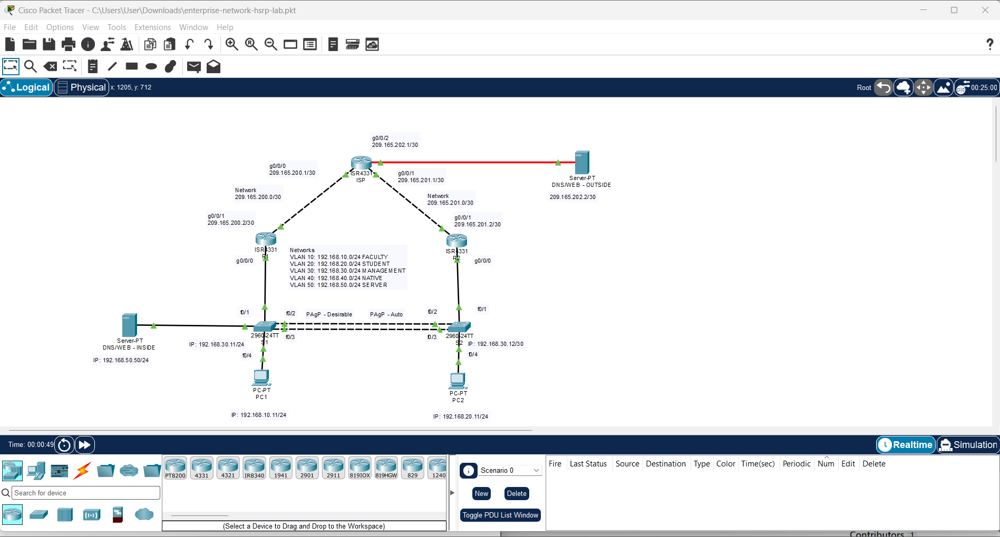

# Cisco Enterprise Network Lab

## Project Overview

This project demonstrates the configuration and troubleshooting of an enterprise network using Cisco Packet Tracer. The network was designed to provide redundancy, VLAN segmentation, gateway availability, and connectivity to internal and external network resources.

The lab gave me hands-on experience configuring Cisco routers and switches and troubleshooting connectivity between multiple network segments.

## Network Topology

The topology includes two enterprise routers, two switches, an ISP router, internal and external servers, and client PCs.

## Technologies and Concepts

- VLANs and network segmentation
- 802.1Q trunking
- EtherChannel / Port-Channel
- PAgP
- Spanning Tree Protocol (STP)
- HSRP Version 2
- First Hop Redundancy
- Static and default routing
- NAT
- Access Control Lists (ACLs)
- Inter-VLAN connectivity
- Network troubleshooting

## VLAN Structure

| VLAN | Network | Purpose |
|------|---------|---------|
| 10 | 192.168.10.0/24 | Faculty |
| 20 | 192.168.20.0/24 | Student |
| 30 | 192.168.30.0/24 | Management |
| 40 | 192.168.40.0/24 | Native |
| 50 | 192.168.50.0/24 | Server |

## HSRP Redundancy

HSRP Version 2 was configured to provide redundant default gateways for the VLANs. R1 and R2 participate in HSRP so that if the active gateway becomes unavailable, the standby router can take over gateway responsibilities.

This provides improved network availability and reduces the impact of a router failure.

## Switching and Redundancy

The switches use redundant connections to provide additional availability. EtherChannel combines multiple physical links into a logical Port-Channel while STP helps prevent Layer 2 switching loops.

Trunk links carry traffic for multiple VLANs between network devices.

## Network Services

The topology contains an internal DNS/Web server on the server VLAN and an external DNS/Web server connected through the ISP network. This allows testing of both internal network communication and connectivity to external resources.

## Troubleshooting and Verification

I used Cisco IOS verification and troubleshooting commands including:

- `show ip interface brief`
- `show vlan brief`
- `show interfaces trunk`
- `show etherchannel summary`
- `show spanning-tree`
- `show standby brief`
- `show ip route`
- `ping`
- `traceroute`

These commands were used to verify interface status, VLAN membership, trunking, EtherChannel operation, HSRP status, routing, and end-to-end connectivity.

## Project Files

- `enterprise-network-hsrp-lab.pkt` — Cisco Packet Tracer lab
- `enterprise-network-topology.png` — Network topology diagram
-  `enterprise-network-hsrp-configurations.txt` — Complete R1, R2, S1, S2, and ISP configurations with verification commands

## Skills Demonstrated

This project demonstrates practical experience with Cisco IOS, Layer 2 switching, Layer 3 routing, network redundancy, VLAN segmentation, gateway redundancy, network services, and systematic network troubleshooting.
